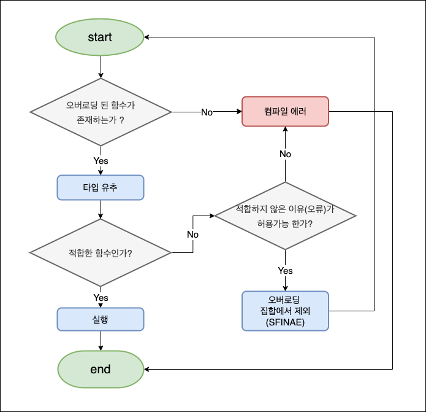

# 개요(Summary)

`ft_containers`에서는 `std::enable_if`와 `std::is_integral` 클래스를 재구현 하도록 요구하고 있습니다.

해당 메소드들은 `C++11` 이후부터 구현되어 있는 클래스들로, `C++98` 표준으로 구현이라는 과제 기본 규칙에 위배되어 의문이 생길 수 있습니다.

하지만 해당 클래스들은 C++98 표준만으로 충분히 구현이 가능하고, `템플릿 메타 프로그래밍(template meta programming)`과 `SFINAE(substitution failure is not an error)`의 개념을 이해할 수 있는 좋은 예시이기 때문에, 해당 개념들과 함께 글을 작성했습니다.

# 목차(Contents)
- [개요(Summary)](#개요summary)
- [목차(Contents)](#목차contents)
- [일반화 프로그래밍(Generic Programming)](#일반화-프로그래밍generic-programming)
- [템플릿 메타 프로그래밍(Template meta programming - TMP)](#템플릿-메타-프로그래밍template-meta-programming---tmp)
- [템플릿 메타 함수(Template meta function)](#템플릿-메타-함수template-meta-function)
- [`integral_constant`](#integral_constant)
- [`is_integral`](#is_integral)
- [`SFINAE(substitution failure is not an error)` : 치환 실패는 오류가 아니다.](#sfinaesubstitution-failure-is-not-an-error--치환-실패는-오류가-아니다)
    - [오버로드 함수 선택 우선순위](#오버로드-함수-선택-우선순위)
      - [`1순위 : 정확하게 일치하는 함수`](#1순위--정확하게-일치하는-함수)
      - [`2순위 : 함수 템플릿`](#2순위--함수-템플릿)
- [`enable_if`](#enable_if)
- [Reference](#reference)
# 일반화 프로그래밍(Generic Programming)

`일반화 프로그래밍`이란 컴퓨터 프로그래밍의 한 유형으로, 특정 객체(인터페이스, 클래스, 메소드 등)의 `타입`이 `작성 단계에서 정해지지 않고`, 후에 제공되는 `파라미터의 타입에 따라 그에 맞게 인스턴스화` 되도록 프로그램을 작성하는 것입니다. 즉, 

> `타입이 작성 단계에서 정해진다`의 의미는 아래와 같이 특정 `int` 형 매개변수를 받아 `int`형 값으로 반환 하는 것 처럼 특정 타입으로 작성하는 것을 말합니다.
> ```c++
> int add(int x, int y);
> ```

`c++`에서 일반화 프로그래밍은 `템플릿(template)`을 이용해 이루어 집니다.

```c++
// 함수 템플릿
template <typename T>
T add(T t1, T t2) { return t1 + t2; }

// 클래스 템플릿
template <class T>
class Calculator {
public:
  T add(T t1, T t2) { return t1 + t2; }
  T sub(T t1, T t2) {	return t1 - t2; }
  T mul(T t1, T t2) { return t1 * t2; }
  T div(T t1, T t2) { return t1 / t2; }
};
```

> 위의 예시에서 함수 템플릿 `add()`는 템플릿 매개변수가 `typename`으로 선언되어있고, 클래스 템플릿 `Calculator`는 `class`로 선언되어 있습니다. 템플릿 매개변수를 선언할 때 사용하는 `typename`과 `class`는 동일한 의미를 같습니다. 하지만 `typename` 키워드 템플릿 매개변수가 아닌 곳에서 사용 될 때는 별도의 기능을 가지고 있습니다.

위의 예시처럼 `template` 키워드와 선언과 함께 `<typename T>` 혹은 `<class T>`와 같은 형식으로 `템플릿 매개변수`를 선언하고 `T`를 타입처럼 사용하면, 템플릿 매개변수 `T`에 전달되는 타입에 따라 컴파일 단계에서 컴파일러가 해당 타입으로 치환시킨 새로운 객체를 생성하게 됩니다.

```c++
// int형 타입을 갖는 함수 템플릿 add() : <typename T = int>
add<int>(a, b);
```
```c++
T add(T t1, T t2) { return t1 + t2; }
// compile, T -> int로 치환
int add(int t1, int t2) { return t1 + t2; }
```
```c++
// <class T = int>
Calculator<int> calc;
```
```c++
// Compile, T -> int로 치환
class Calculator {
public:
  int add(int t1, int t2) { return t1 + t2; }
  int sub(int t1, int t2) { return t1 - t2; }
  int mul(int t1, int t2) { return t1 * t2; }
  int div(int t1, int t2) { return t1 / t2; }
}
```
위의 `Calculator` 클래스 템플릿은 `+, -, *, /` 연산이 가능한 모든 타입에 대응 할 수 있습니다.

이처럼 템플릿을 사용한 일반화 프로그래밍은 `코드의 효율성`을 높이기 위해 사용합니다. 특정 알고리즘이나 구현하고자 하는 객체를 템플릿으로 작성하면 다양한 타입에 따라 컴파일러가 객체를 생성해주기 때문에 프로그래머가 직접 인스턴스를 추가 작성하거나 오버로딩 할 필요가 없어지기 때문에 `코드의 재사용성`을 크게 높여줍니다.

템플릿 매개변수는 필요에 따라 2개 이상을 선언해 다양하게 이용 할 수 있습니다.

```c++
template <class T1, class T2>
class pair {
public:
  T1 first;
  T2 second;
};
```
```c++
pair<char, int> p;
```
```c++
// compile
// <class T1 = char, class T2 = int>
class pair {
public:
  char first;
  int second;
};
```
---
# 템플릿 메타 프로그래밍(Template meta programming - TMP)

앞서 `C++`에서 일반화 프로그래밍은 `템플릿(template)` 키워드를 사용해 다양한 `타입`에 컴파일러가 대응 할 수 있도록 하는 프로그래밍 방식이라고 설명했습니다. 이 때 `타입`은 일반적으로 어떤 객체에 어떠한 데이터를 저장할건지를 나타내는 형식으로 사용됩니다. `int, char, double, string 등`의 자료형이 대표적인 예시라고 할 수 있습니다. 이 때의 `타입` 자체는 어떤 특정한 값을 지니지 않습니다.

하지만 템플릿을 사용할 때, `반드시 특정 자료형만을 템플릿 매개변수로 사용해야 하는 것은 아닙니다.` 템플릿으로 선언된 타입 또한 활용할 수 있습니다. 이 때 템플릿으로 선언된 타입은 `객체를 생성하지 않더라도 특정 값을 가질 수 있고`, 이 타입을 템플릿 매개변수로 활용해 프로그래밍을 할 수 있습니다. 타입은 `컴파일 타임에 확정`되어야만 하므로 템플릿을 활용해 컴파일 타임 생성되는 코드로 프로그래밍 하는 것을 `템플릿 메타 프로그래밍(Template meta programming)`이라고 합니다.

이해하기 쉽도록 `int`형 데이터 `10`을 출력하는 예시를 일반화 프로그래밍과 TMP를 사용한 예시를 들어보겠습니다.

+ generic programming

  ```c++
  template <class T>
  struct something {
    T value;
    something(T v = 0) : value(v) {}
  };

  int main() {
    something<int> a(10); // 런타임에 something<int> 타입의 a객체 생성
    std::cout << a.value << std::endl; // 출력 결과 : 10
  }
  ```

	위의 코드에서는 `프로그램 실행시(런타임)`에 `something<int>` 타입의 객체 `a`가 생성됩니다. 이 때 생성자 매개변수로 `10`이 전달되고, `a` 객체의 멤버 변수 `value`는 `10`으로 초기화 됩니다. `객체의 생성은 런타임에 이루어집니다.` 이때 객체가 생성되는 처리시간이 발생하고, 메모리 공간을 차지합니다. 즉, `런타임 오버헤드가 발생`합니다.

+ TMP

  ```c++
  template <class T, T v>
  struct something {
    static const T value = v;
  };

  int main() {
    typedef something<int, 10> value_t; // 컴파일 타임에 타입 정의
    std::cout << value_t::value << std::endl; // 출력 결과 : 10
  }
  ```

	위의 코드에서 `something`은 템플릿 매개변수로 타입 `T`와 `T` 타입의 변수 `v`를 받습니다. 그리고 `v`는 `something` 멤버 변수 `value`의 값으로 초기화 됩니다. 따라서 템플릿 매개변수로 `int`와 `10`을 전달 받은 타입을 `value_t`로 `정의(typedef)`하게 되면 `value_t::value`를 참조해 `10`이라는 값을 얻을 수 있고, `타입은 컴파일 과정에서 확정`되기 때문에 이 과정은 모두 컴파일 과정에서 이루어집니다. 이 경우, `컴파일 시간이 증가` 할 수 있지만, `런타임 오버헤드`는 줄일 수 있습니다.

+ TMP의 다양한 예시

  ```c++
  // 템플릿의 재귀적 활용 : factorial 계산하기
  template <int N>
  struct factorial {
    static const int result = N * factorial<N - 1>::result;
  };
  // 재귀 탈출 조건, 템플릿 특수화(template specialization)
  template <>
  struct factorial<1> {
    static const int result = 1;
  };
  ```

  ```c++
  // 템플릿의 재귀적 활용 : 유클리드 호제법을 사용한 최대 공약수, 최소 공배수 구하기
  template <int X, int Y>
  struct euclidean {
    static const int gcd = euclidean<Y, X % Y>::gcd; // 최대 공약수
    static const int lcm = (X * Y) / gcd; // 최소 공배수
  };

  // 재귀 탈출 조건
  template <int X>
  struct euclidean<X, 0> {
    static const int gcd = X;
  };
  ```
---
# 템플릿 메타 함수(Template meta function)

`템플릿 메타 함수`란 함수 처럼 동작하는 템플릿 클래스를 말합니다.

```c++
// (1) function
bool boolean(bool condition) {
  if (condition == true)
    return true;
  return false;
}
```
```c++
// (2) template meta function
template <bool condition>
struct boolean {
  static const bool _condition = condition;
}
```

위의 두 예시는 모두 `bool` 타입의 `condition`을 매개변수로 받아 `참, 거짓`인지 연산하는 코드입니다.

(1)번 `bool boolean()`은 `bool` 타입 매개변수 `condition`을 받아 값이 참일 경우 `true`를 반환하고, 거짓일 경우 `false`를 반환 하는 일반 함수입니다. 이 일반 함수는 `런타임`에 `boolean(true)`, `boolean(false)`와 같이 함수 매개변수를 받아 구현에 따라 연산 수행하고 값을 반환합니다. 즉, `값에 대한 연산`을 수행합니다.

반면 (2)번 `struct boolean` 클래스 템플릿으로 선언되어, `bool` 타입 템플릿 매개변수 `condition`을 받고, 해당 값을 멤버 변수 `_condition`에 저장합니다. 이 클래스는 `컴파일 타임`에 `typedef boolean<true>`, `typedef boolean<false>`와 같은 타입으로 정의 될 수 있고, 정의된 타입 내부의 `_condition`을 참조해 값을 얻을 수 있습니다. 즉, `타입에 대한 연산`을 수행합니다.

결론적으로 (2)번 처럼 템플릿 메타 프로그래밍에서 함수는 아니지만 마치 함수처럼 사용 하는 템플릿 클래스들을 `템플릿 메타 함수(template meta function)`라고 합니다.

---

# `integral_constant`

`TMP`는 C++ 표준 라이브러리에서도 다양하게 쓰이고 있습니다. 이 중 `integral_constant`는 정수 상수값을 타입으로 활용할 수 있도록 해주는 `템플릿 메타 함수`입니다. 일반적으로 `bool` 타입 값을 활용해 `참, 거짓`을 상수값으로 활용 할 때 자주 사용됩니다.

`<type_traits>` 헤더에 정의 및 구현이 선언되어 있고, 내부적으로 `integral_constant<bool, true>` 타입을 `true_type`으로 정의하고, `intergral_constant<bool, false>` 타입을 `false_type`으로 정의해 `alias`들을 제공하고 있습니다.

**prototype**

```c++
template <class T, T v>
struct integral_constant {
  static constexpr T value = v;
  typedef T value_type;
  typedef integral_constant<T, v> type;
  constexpr operator value_type() { return value; }
}


typedef integral_constant<bool, true> true_type;
typedef integral_constant<bool, false> false_type;
```

> C++ 버전(일반적으로 C++ 14 이후)이나 구현에 따라 bool 타입 템플릿 특수화 선언 `bool_constant`가 존재합니다.
>```c++
>template <bool B>
>using bool_constant = integral_constant<bool, B>;
>typedef bool_constant<true> true_type;
>typedef bool_constant<false> false_type;
>```

**template parameter-list**

+ `T`

  정수 상수값의 타입을 의미합니다.

+ `v`

  `T` 타입의 정수 상수값입니다. `integral_constant::value`에 접근해 값을 참조 할 수 있습니다.

**member_type**

| member_type | definition                   |
| ----------- | ---------------------------- |
| value_type  | 상수의 타입을 말합니다.      |
| type        | 자가 자신의 타입 정의입니다. |

**member function**

+ `operator value_type()` : 함수 호출자 오버로딩

  `value`를 반환합니다. 반환값은 템플릿 매개변수 `T v`와 같습니다.
  
  ```c++
  constexpr operator value_type();
  ```
---
# `is_integral`

표준 라이브러리에서 [`integral_constant`](#integral_constant)를 활용한 가장 기초적인 `템플릿 메타 함수`입니다. 템플릿 매개변수의 타입에 따라 `integral_constant`의 `true_type` 혹은 `false_type`을 상속 받음으로써 특정 타입이 정수 타입인지를 연산해주는 템플릿 메타 함수입니다.

다음과 같은 형식들이 기본 정수 타입으로 간주됩니다.

| types                  |
| ---------------------- |
| bool                   |
| char                   |
| char16_t               |
| char32_t               |
| wchar_t                |
| signed char            |
| short int              |
| int                    |
| long int               |
| long long int          |
| unsigned char          |
| unsigned short int     |
| unsigned int           |
| unsigned long int      |
| unsigned long long int |

**prototype**
```c++
//default
template <class T>
struct is_integral : false_type {};
```

가장 기본 타입은 `false_type`을 상속받습니다. `false_type`은 `integral_constant<bool, false>`를 `정의(typedef)`한 `alias`이기 때문에 멤버 변수 `integral_constant<bool, false>::value`는 `false`로 초기화 됩니다.

**implementation**
```c++
// specialization
template <>
struct is_integral<bool> : true_type {};
template <>
struct is_integral<char> : true_type {};
template <>
struct is_integral<char16_t> : true_type {};
template <>
struct is_integral<char32_t> : true_type {};
template <>
struct is_integral<wchar_t> : true_type {};
template <>
struct is_integral<short int> : true_type {};
template <>
struct is_integral<int>> : true_type {};
template <>
struct is_integral<long int> : true_type {};
template <>
struct is_integral<long long int> : true_type {};
template <>
struct is_integral<unsigned char> : true_type {};
template <>
struct is_integral<unsigned short int> : true_type {};
template <>
struct is_integral<unsigned int> : true_type {};
template <>
struct is_integral<unsigned long int> : true_type {};
template <>
struct is_integral<unsigned long long int> : true_type {};
```

이처럼 특정 타입에 대한 특수화로 `is_integral`을 정수 타입인지 판별하는 템플릿 메타 함수로 사용할 수 있고, 아래와 같이 값을 참조 할 수 있습니다.

```c++
// typedef를 사용해 의존참조
typedef is_integral<int> int_t;
int_t::value;

// 선언과 동시에 직접 참조
is_integral<char>::value;

// integral_constant의 operator 오버로딩을 활용
is_integral<unsigned int>();
```
---
# `SFINAE(substitution failure is not an error)` : 치환 실패는 오류가 아니다.

```c++
// overload set
template <class T>
T foo(T& x, T y) {
  //do something...
}
template <class To, class From>
To foo(To& x, From& y) {
  //do something...
}
template <class T>
typename T::member_type foo(T& x) {
  //do something
}

int main() {
  // do something
  foo(x, y) // template argument deduction
}
```

`SFINAE`란 `함수 템플릿`이 포함된 `오버로드 집합이 존재`할때, 적합한 함수를 찾는 과정에서 `치환 실패`가 발생한 경우, `컴파일 에러`를 발생시키는 것이 아니라 `오버로드 함수 집합`에서 `해당 함수를 제외`시킴으로써 불필요한 코드 생성을 막고, `정적 다형성(static polymorphism)`을 구현할 수 있도록 해주는 기법입니다.

`SFINAE`를 명확하게 이해하기 위해서는 아래 내용을 이해할 필요가 있습니다.

1. 오버로드 함수 선택 우선순위
2. 템플릿 인자 추론과 치환
3. Substitution failure : 어떤 경우 오류가 아닌 `치환실패`고, 어떤 경우에 `오류(hard error)`인가?
4. `SFINAE`의 활용

<!-- **컴파일러의 오버로드 함수 선택과 템플릿 인자 추론** -->

### 오버로드 함수 선택 우선순위
```c++
// 1번 예시 
void print(std::string x) {
  std::cout << "string : " << x << std::endl;
}

int main() {
  print("hello world");
}
```
```bash
> ./a.out
> string : hello world
```

위 예시는 `string` 타입 매개변수를 받는 `print()` 함수가 1개 선언되어 있습니다. 실행 결과는 물론 `string : hello world`입니다.


#### `1순위 : 정확하게 일치하는 함수`
```c++
// 2번 예시
void print(const char* x) {
  std::cout << "const char * :" << x << endl;
}
void print(std::string x) {
  std::cout << "string : " << x << std::endl;
}
template <class T>
void print(const T& x) {
  std::cout << "template : " << x << std::endl;
}

int main() {
  print("hello world");
}
```
```bash
> ./a.out
> const char * : hello world
```
그렇다면 위의 코드의 실행결과는 어떨까요? `hello world`는 문자열이기 때문에 `void print(std::string x)`가 실행될까요?

실행 결과는 `const char * : hello world`로 `void print(const char *)` 함수가 호출 됩니다. 

왜냐하면 `print("hello world")` 구문의 `hello world`는 `문자열 리터럴`입니다. `C++`에서 문자열 리터럴은 `const char[n]` 타입으로 선언됩니다. 따라서 `void print(std::string x)`의 경우에는 `const char[n] -> std::string`과 같은 형변환(정확히는 string 객체 생성)이 이뤄져야 하고, 함수 템플릿 `void print(const T& x)`는 템플릿 `인자 치환`이 이뤄져야 합니다. 반면 `void print(const char* x)`는 매개변수의 타입이 `정확하게 일치`하므로 컴파일러는 이 함수를 선택합니다.


#### `2순위 : 함수 템플릿`
```c++
// 3번 예시
void print(std::string x) {
  std::cout << "string : " << x << std::endl;
}
template <class T>
void print(const T& x) {
  std::cout << "template : " << x << std::endl;
}

int main() {
  print("hello world");
}
```
```bash
> ./a.out
> template : hello world
```
이번 예시는 정확하게 일치하는 함수가 없는 경우입니다. 이 때 `void print(std::string x)`는 값 복사와 객체 생성(매개변수를 참조자 선언하지 않았기 때문에)이 발생하고, `void print(const T& x)`는 `인자 치환`만으로 동작 가능하기 때문에 `함수 템플릿`이 실행되어, `template : hello world`가 출력됩니다.


```c++
// 1번
template <class T>
struct my_data {
  typedef T value_type;
  value_type value;
  my_data(const T& val = 0) : value(val) {};
}

template <class T>
typename T::value_type sum(T& x, T& y) {
  cout << "T::value_type sum : " << x.value + y.value << endl;
  return x.value + y.value;
}
// 2번
template <class T>
T sum(T& x, T& y) {
  cout << "T sum : " << x + y << endl;
  return x + y;
}

int main() {
  int a = 10;
  int b = 20;
  sum(a, b); // 2번 함수 템플릿 실행, T sum : 30
  my_data<int> c(10);
  my_data<int> d(20);
  sum(c, d); // 1번 함수 템플릿 실행, T::value_type sum : 30
}
```

다음 예시입니다. 똑같이 템플릿 매개변수 `T`를 사용하는 `sum` 오버로딩 함수들입니다. 이 때 `sum(int, int)`형식으로 호출하면 `int` 타입에는 멤버 타입 `value_type`이 존재하지 않기 때문에 `1번 함수 템플릿`은 오버로드 집합에서 제외되고, `T sum()`함수가 실행됩니다.

반면 `my_data`는 


이처럼 컴파일러는 특정 함수의 오버로딩 리스트가 존재하는 경우 해당 집합에서 가장 적합한 함수를 찾습니다.
이 때 만약 

> 마찬가지로 1번 예시에서도 `"hello world"`는 `const char[n]` 타입이고, 컴파일러가 대신 `std::string`으로 형변환을 한 뒤, 함수를 실행하게 됩니다.


이번에는 함수 템플릿 오버로딩 예시를 살펴보겠습니다. 



---
# `enable_if`

**prototype**
```c++
template <bool, class T = void>
struct enable_if {};
```

`enable_if`의 기본 타입은 아무것도 존재하지 않는 `빈(empty)` 클래스 형태로 선언됩니다.

**implementation**
```c++
// specialization
template <class T>
struct enable_if<true, T> {
  typedef T type;
}
```

템플릿 매개변수로 `true`가 들어오는 경우에 한해서만 타입 `T`를 `type`으로 `aliasing` 하도록 합니다.

```c++
enable_if<true, T>::type // true인 경우 type 존재
enable_if<false, T>::type // 에러 : false인 경우 type 없음.
```

반면 `false`가 들어오는 경우에는 기본 선언형인 비어있는 `enable_if` 템플릿으로 동작하기 때문에 내부에 `alias`가 존재하지 않습니다.

결과적으로 `enable_if`는 `특정 타입에 대한 (참 혹은 거짓을 반환하는)연산결과`와 해당 `타입`을 템플릿 매개변수로 받아 `true`인 경우 타입에 대한 `alias`를 정의하고, `false`인 경우에는 아무것도 정의하지 않음으로써 일종의 조건문 처럼 `alias`의 존재 유무에 따라 컴파일 타임에 `분기`를 가능하게 해줍니다.

```c++

```

# Reference

https://www.definitions.net/definition/generic+programming Unknown
https://www.geeksforgeeks.org/generics-in-c/ 01 APR, 2019