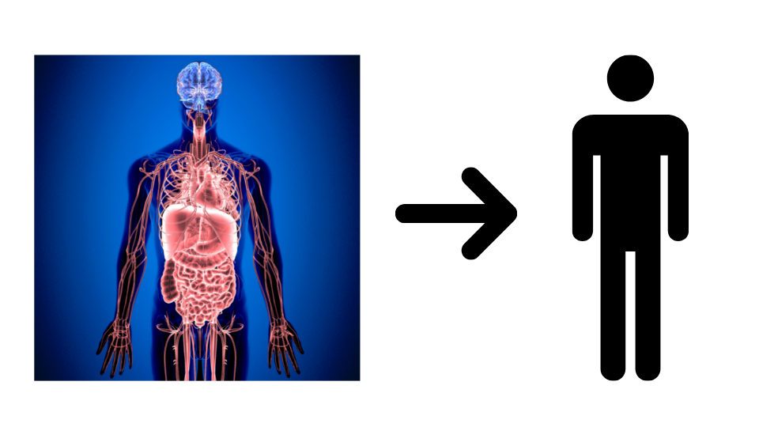
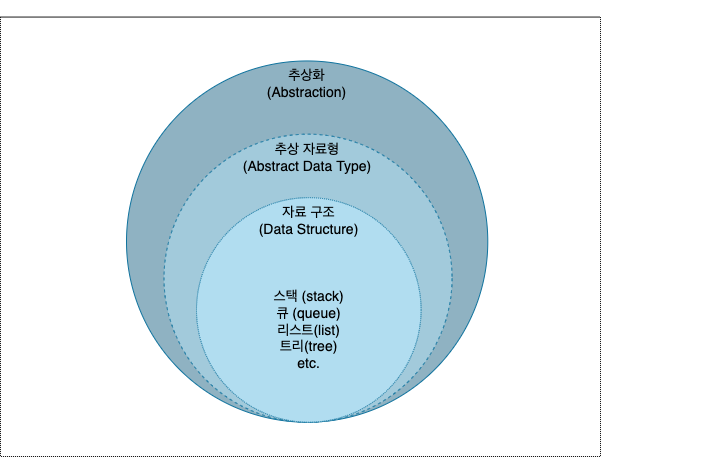
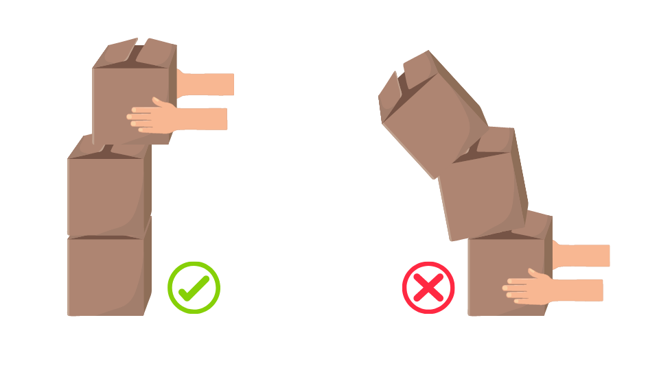

# 추상화, 추상 자료형, 자료구조

<!--  -->

<!-- > 추상 : 여러 가지 사물이나 개념에서 공통되는 특성이나 속성 따위를 추출하여 파악하는 작용. [1] -->

### 컴퓨터 프로그래밍이란

`컴퓨터 프로그래밍`은 현실에 존재하는 문제나 대상을 디지털 셰계로 옮겨와 컴퓨터의 연산능력을 통해 해결하고 표현하기 위한 방법입니다. 인간은 문제 해결을 위해 다채롭게 현실 세계를 인지하고, 논리적이거나 직관적인 사고를 할 수 있지만, 컴퓨터는 `0`과 `1`로 이루어진 전기 신호, 즉 `2진 구조`를 같는 한 개의 `비트`를 최소 단위로 일련의 연산을 수행합니다.

> 사실 0과 1 이진 표현도 인간이 이해하기 쉽도록 표현한 방식입니다. 이를 `기계어(Machine Language, Machine Code)`라고 합니다. 따라서 엄밀히 말하면 컴퓨터는 숫자 자체를 인식하는것이 아니고, 자신을 구성하고 있는 회로의 전압차이를 통해 2가지 상태를 갖습니다. 예를 들면 회로에 5v 전압이 흐르면 `1(신호가 들어옴)`, 전압이 0v 이거나 접지 전압이면 `0(신호가 들어오지 않음)`으로 포현할 수 있습니다. [2](#reference)

컴퓨터가 처리할 수 있는 정보는 0과 1 두 가지 뿐이라는 점에서 굉장히 단순하지만, 컴퓨터는 인간의 두뇌로는 처리하기 힘든 막대한 양의 정보를 순식간에 처리할 수 있습니다. 하지만 이런 연산 능력을 활용하기 위해서는 컴퓨터에게 우리가 다루고자 하는 `대상`이나 원하는 `동작`을 어떤 대상이고 어떤 동작을 하길 바라는지 `정의`해야 하고, 정의된 내용을 컴퓨터가 처리가능한 방식으로 `구현`하는 과정이 필요합니다. 이렇게 만들어진 결과물이 `프로그램`이고, 이 과정을 `프로그래밍`이라고 합니다.

<i>애니악(ENIAC) 프로그래밍,</i>
 <a href="https://media.gettyimages.com/photos/computer-operators-program-eniac-the-first-electronic-digital-by-picture-id615303458?s=2048x2048">© CORBIS/Corbis via Getty Images</a>

`애니악(ENIAC)`과 같은 초기 컴퓨터에서 프로그래밍은 거대한 기기의 외부로 들어나 있는 스위칭 소자 배선판에 선을 결선해 연산을 수행하는 방식을 사용했습니다. 예를 들어 어떤 값을 더한 뒤 곱셈을 하고 싶다면, 곱셈기와 덧셈기를 서로 연결하는 식이었습니다. 즉 이 시기의 프로그램은 배선 연결도면이었고, 프로그래밍은 인간이 도면에 따라 직접 선을 연결하는 행위 자체였습니다. 하지만 이후 `폰 노이만 구조`에 따라 설계된 컴퓨터들은 `중앙 처리 장치(CPU)`, `메모리(Memory)`, `대용량 저장장치(Storage)`, `입출력 장치(I/O)`를 갖는 범용 컴퓨터로써 프로그램 내장 방식으로 동작하게 되었습니다.

### 프로그래밍 언어

<i>프로그래밍 언어 컴파일 과정</i>

폰 노이만 아키텍쳐 등장 이후, `작업(프로그램)`의 교체를 위해 하드웨어 차원에서 물리적으로 배선을 재배치 해야했던 기존 시스템에서 벗어나, 프로그램 내장 방식으로 패러다임의 전환이 일어났습니다. 프로그램 내장 방식은 원하는 작업을 위한 데이터와 명령어들을 하나의 `프로그램`으로 작성해 임의 접근이 가능한 메모리에 배열하고 사용하는 방식입니다.

이런 프로그램을 통해 컴퓨터를 제어하기 위해서는, 컴퓨터가 이해가능한 제어신호인 0과 1로 이루어진 데이터와 명령어들을 인간이 작성해야만 했습니다. 하지만 0과 1로만 이루어진 기계어는 길이나 복잡도가 증가할수록 인간이 이해하기에 어려움이 많았습니다. 따라서 보다 인간이 이해하기 쉬운 방식으로 프로그램을 작성할 수 있도록하는 `프로그래밍 언어`들이 등장하게 됩니다.

결국 인간이 이해하기 편하도록 기계어 명령들과 1:1로 대응되는 `어셈블리어`가 등장하게되고, 시간이 지남에 따라 인간의 언어에 가까운 방식으로 프로그래밍을 할 수 있도록 하는 다양한 프로그래밍 언어가 만들어졌습니다.

### 추상화

컴퓨터 공학에서 `추상화(Abstraction)`란, 특정 대상이 가지고 있거나, 혹은 가져야 하는 필수적이고 핵심적인 특징들을 정의하는 하는 것을 말합니다. 조금 더 구체적으로는 `인터페이스` 역할을 하는 `모델`을 만드는 것과 같습니다.

구체적 상황을 예시로 이해해보겠습니다.

어느날 우리 앞에 `컴퓨터`라고 불리는 놀라운 기계가 등장했습니다. 이 컴퓨터는 일련의 데이터들을 `입력` 받아 특정 동작을 수행하고 출력해주는 기계입니다.

우리는 컴퓨터에 입력값을 전달 해주는 새로운 장치를 만들고자 합니다. 이 장치가 가져야 하는 핵심적인 특징은 다음과 같습니다.

1. 컴퓨터에 `연결`해 입력 `데이터`를 `전달`할 수 있어야 한다.
   
2. 데이터는 사람이 `물리적`으로 `입력`한다.

네 이미 아시겠지만 이 장치는 `키보드(keyboard)`입니다.

위의 요구 사항을 바탕으로 키보드를 추상화 시킨 모델은 아래와 같습니다.

키보드는 물리적으로 컴퓨터와 연결할 수 있는 연결부와 사용자로 부터 입력 받을 수 있는 입력부, 입력을 전달할 전송부를 반드시 가져야 하고, 컴퓨터와 `연결`하고 컴퓨터로 데이터를 전달할 수 있는 `사용자 입력`과 `데이터 전송`이라는 동작들을 수행 할 수 있어야 합니다. 이는 모든 키보드가 최소한 공통적으로 가져야하는 `인터페이스(interface)`이자 `명세(specification)`입니다.

이처럼 대상의 핵심적인 특징을 정의하는 과정이 `추상화`이고, 추상화를 통해 정의된 특징들을 기준에 따라 분류해서 계층적으로 표현한 것을 `추상화 계층(Abstraction Layer)`이라고 합니다. 추상화나 추상화 계층은 어떤 수준 까지 어떤 기준으로 구조화 하냐에 따라서 정말 다양하게 나타 날 수 있습니다.

예를 들어 키보드의 `Connect`라는 핵심 기능은 조금 더 세부적으로 추상화 했을 때, `연결 대상 확인`, `연결 방식 확인` 등으로 확장 시킬 수 있고, `Input`은 `언어별 입력`, `특수 문자 입력`, `매크로 입력` 등 추가적인 정의를 내릴 수 도 있습니다. 또한 LED가 설치된 키보드의 경우에는 `Led control` 역시 추가로 정의 할 수 있습니다.

위의 추상화 계층구조는 기계적 관점에서 인터페이스와 기능적 관점에서의 인터페이스로 구분해서 표현한 구조입니다. 따라서 소프트웨어 엔지니어는 위의 추상화된 모델을 바탕으로 핵심 기능을 `구현(Implementation)`하게 되는데, 이 과정이 곧 `프로그래밍`입니다. `키보드`와 같은 `하드웨어` 입출력 기기의 소프트웨어는 `펌웨어(Firmware)`와 `장치 드라이버(Device Driver)`로 구성되어있고, 해당 프로그램은 기가가 정의된 동작을 수행 할 수 있게끔 구현되어 있습니다.

우리가 하는 `프로그래밍`은 현실의 `문제`를 해결하기위해, 문제 해결 방법을 체계적으로 구성해 컴퓨팅 시스템이 효율적으로 처리할 수 있도록 `프로그램`을 작성하는 것입니다.

`스택(Stack)`은 `추상적 자료형(Abstract Data Type, ADT)`이자  `자료구조`의 한 종류로써 사용되고 있습니다.

# `스택(Stack)`이란?

추상화란 어떤 종류의 대상들에 대해 그것이 가져야 할 핵심적인 특징들을 가지는 모델을 만드는 것.
추상적 자료형이란 자료들과 이 자료들에 대한 연산(동작, behavior)을 수학적으로 정의한 이론적인 형태를 말합니다. 

따라서, `C++ 스택 컨테이너` 재구현이 목표인 이번 프로젝트를 진행하기 위해서는 추상적 자료형 스택의 이론적 개념과 이 개념을 바탕으로 구현된 자료구조 스택이라는 두 관점에서 개념을 이해할 필요가 있습니다.
