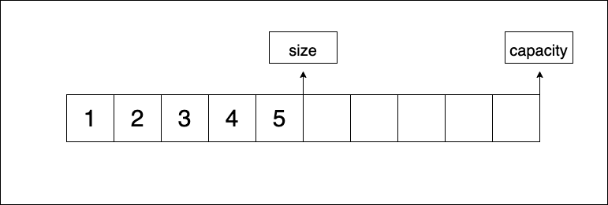
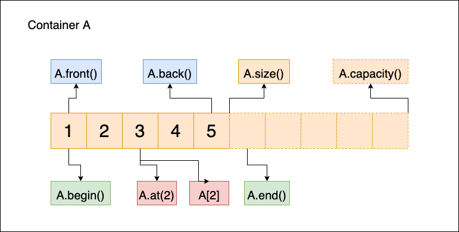

# 벡터(Vector)

## 목차(Contents)

### [1. `std::vector`, 벡터 컨테이너란?](#stdvector-벡터-컨테이너란)
### [2. `std::vector` 클래스](#stdvector-클래스)
+ [개요 (Synopsis)](#개요synopsis)
+ [멤버 타입 (Member types)](#멤버-타입member-types-12)
+ [멤버 함수 (Member functions)](#멤버-함수member-function)
  + [OCF (Orthodox Canonical Form)](#ocforthodox-canoical-form)
  + [Iterator](#iterator)
  + [Capacity](#capacity)
  + [Element access](#element-access)
  + [Modifiers](#modifiers)
+ [비-멤버 함수 (Non-menber Function)](#비-멤버-함수-non-menber-function)
### [3. 참고 자료 (Reference)](#reference)
---
# `std::vector`, 벡터 컨테이너란?

> `std::vector` is a `sequence` container that encapsulates `dynamic size` arrays <sup>[1]

[cppreference](https:://cppreference.com)에서 벡터를 정의한 구문을 그대로 인용하자면
**벡터(vector)** 란 [`캡슐화(encapsulate)`](https://ko.wikipedia.org/wiki/%EC%BA%A1%EC%8A%90%ED%99%94)된 `가변 길이(dynamic size)` 배열 형태의 `시퀀스 컨테이너` 입니다.

벡터는 일반 배열처럼 원소를 `순차적`으로 보관한다는 점에서 `시퀀스 컨테이너`로 분류됩니다. 다만 일반 배열과 다른 것은 `가변 길이 배열(dynamic size array)`이라는 점입니다.

```c++
#define SIZE 5

int array[SIZE];

int *array_ptr = malloc(sizeof(int) * SIZE);
int *array_ptr = new int[SIZE];
```

위와 같이 선언된 일반 배열은 `처음 할당된 SIZE 만큼`의 원소들만 가질 수 있습니다. 하지만 `벡터 컨테이너`는 원소가 추가 혹은 삭제됨에 따라 자동으로 메모리를 `재할당`해 크기를 `동적(dynamic)`으로 변경 해줍니다.

+ 벡터 컨테이너의 속성

 | 속성      | 내용                                                                                                                                                                                    |
 | --------- | --------------------------------------------------------------------------------------------------------------------------------------------------------------------------------------- |
 | sequence  | 벡터의 원소들은 선형적인 순서로 정렬됩니다. 각 원소들은 이 순서상 자신의 위치에 따라 접근 될 수 있습니다.                                                                               |
 | dynamic   | 원소가 추가 혹은 삭제됨에 따라 동적으로 메모리가 관리되고, 포인터, 반복자를 통해 각 원소에 접근할 수 있습니다. 또한 컨테이너의 마지막 위치에서 원소를 빠르게 추가, 제거 할 수 있습니다. |
 | Allocator | 벡터는 `std::allocator` 객체를 사용해 필요한 메모리를 동적으로 관리합니다.                                                                                                              |
 ---
# `std::vector` 클래스

벡터 컨테이너는 아래와 같은 클래스 템플릿으로 정의되어 있습니다.

```c++
template < class T, class Allocator = allocator<T> >
class Vector;
```

+ `T`

	벡터 컨테이너 원소의 타입으로 사용되는 `템플릿 파라미터`입니다.
	벡터 클래스 내부에서 `value_type`으로 `재정의(typedef)` 됩니다.

+ `Allocator`

	메모리 할당을 수행하는 객체입니다. 기본적으로 `std::allocator<T>` 객체가 할당되어 있고, 벡터 클래스 내부에서 `allocator_type`으로 `재정의(typedef)` 됩니다.
---
## 개요(Synopsis)

```c++
// Vector Synopsis
template < class T, class Allocator = std::allocator<T> >
class vector {
public:
	//기본 타입 선언
	typedef T								value_type;
	typedef Allocator							allocator_type;
	typedef typename allocator_type::size_type				size_type;
	typedef typename allocator_type::difference_type			difference_type;
	// 참조자 타입 선언
	typedef typename allocator_type::reference				reference;
	typedef typename allocator_type::const_reference			const_reference;
	// 포인터 타입 선언
	typedef typename allocator_type::pointer				pointer;
	typedef typename allocator_type::const_pointer				const_pointer;
	// 반복자 타입 선언
	typedef std::iterator<random_access_iterator_tag, pointer>		iterator;
	typedef std::iterator<random_access_iterator_tag, const_pointer>	const_iterator;
	typedef typename std::reverse_iterator<iterator>			reverse_iterator;
	typedef typename std::reverse_iterator<const_iterator>			const_reverse_iterator;

	// 생성자/소멸자
	explicit vector(const Allocator& alloc = Allocator());
	explicit vector(size_type n, const T& value = T(),
			const Allocator& allocator = Allocator());
	template <class InputIterator>
		vector(InputIterator first, InputIterator last,
			const Allocator& allocator = Allocator());
	explicit vector(const vector<T, Allocator>& x);
	~vector(void);

	// 대입 연산자
	vector<T, Allocator>& operator=(const vector<T, Allocator>& x);

	//iterator
	iterator		begin(void);
	const_iterator		begin(void) const;
	iterator		end(void);
	const_iterator		end(void) const;
	reverse_iterator	rbegin(void);
	const_reverse_iterator	rbegin(void);
	reverse_iterator	rend(void);
	const_reverse_iterator	rend(void);

	//capacity
	size_type	size(void) const;
	size_type	max_size(void) const;
	void		resize(size_type n, value_type val = value_type());
	size_type	capacity(void) const;
	bool		empty(void) const;
	void		reserve(size_type n);

	// element access
	reference	operator[](size_type n);
	const_reference	operator[](size_type n) const;
	reference	at(size_type n);
	const_reference	at(size_type n) const;
	reference	front(void);
	const_reference	front(void) const;
	reference	back(void);
	const_reference	back(void) const;

	// modifiers
	template <class InputIterator>
		void	assign(InputIterator first, InputIterator last);
	void	assign(size_type n, const T& u);
	void		push_back(const T& x);
	void		pop_back(void);
	iterator	insert(iterator position, const T& x);
	void		insert(iterator position, size_type n, const T& x);
	template <class InputIterator>
		void	insert(iterator position, InputIterator first, InputIterator last);
	iterator	erase(iterator position);
	iterator	erase(iterator first, iterator last);
	void		swap(vector<T, Allocator>&);
	void		clear(void);

	//allocator
	allocator_type	get_allocator(void) const;
};
// relation operator
template <class T, class Allocator>
	bool operator==(const vector<T, Allocator>& x, const vector<T, Allocator>& y);
template <class T, class Allocator>
	bool operator!=(const vector<T, Allocator>& x, const vector<T, Allocator>& y);
template <class T, class Allocator>
	bool operator<(const vector<T, Allocator>& x, const vector<T, Allocator>& y);
template <class T, class Allocator>
	bool operator>(const vector<T, Allocator>& x, const vector<T, Allocator>& y);
template <class T, class Allocator>
	bool operator<=(const vector<T, Allocator>& x, const vector<T, Allocator>& y);
template <class T, class Allocator>
	bool operator>=(const vector<T, Allocator>& x, const vector<T, Allocator>& y);
```
## 멤버 타입(Member types) <sup>[1][2]


| member type            | definition                                                                                        | note                                                                   |
| ---------------------- | ------------------------------------------------------------------------------------------------- | ---------------------------------------------------------------------- |
| value_type             | `템플릿 파라미터 T`, 벡터에 저장된 데이터 형식을 나타냅니다.                                      | -                                                                      |
| allocator_type         | `템플릿 파라미터 Allocator`, 벡터 클래스에 메모리를 관리하는 객체입니다.                          | 기본은 표준 라이브러리의 `std::allocator` 클래스로 설정 되어 있습니다. |
| reference              | 벡터에 저장된 원소의 `참조자`를 제공하기 위한 타입입니다.                                         | `std::allocator::value_type&`                                          |
| const_reference        | 벡터에 저장된 원소의 `참조자`를 `const`로 제공하기 위한 타입입니다.                               | `std::allocator::const value_type&`                                    |
| pointer                | 벡터의 원소에 대한 `포인터`를 제공하기 위한 타입입니다.                                           | `std::allocator::value_type*`                                          |
| const_pointer          | 벡터의 원소에 대한 `const 포인터`를 제공하기 위한 멤버 타입입니다.                                | `std::allocator::const value_type*`                                    |
| iterator               | `value_type`의 원소에 접근하기 위한 `임의 접근 반복자(Ramdom Access Iterator)`입니다.             | -                                                                      |
| const_iterator         | `const value_type`의 원소에 접근하기 위한 `임의 접근 반복자(Ramdom Access Iterator)`입니다.       | -                                                                      |
| reverse_iterator       | 역방향 벡터 원소에 접근할 수 있는 `임의 접근 반복자(Random Access Iterator)` 입니다.              | -                                                                      |
| const_reverse_iterator | 역방향 벡터 `const` 타입 원소에 접근할 수 있는 `임의 접근 반복자(Random Access Iterator)` 입니다. | -                                                                      |
| difference_type        | 벡터 내의 두 원소간 `주소 차이`를 제공하기 위한 타입입니다.                                       | 보통 `ptrdiff_t`와 같습니다.                                           |
| size_type              | 벡터 `원소의 수`를 표현하는 형식입니다.                                                           | 보통 `size_t`와 같습니다.                                              |
---
## 멤버 함수(Member Function)

### OCF(Orthodox Canoical Form)

#### 생성자 (Constructor)
```c++
  // 기본 생성자 (default constructor)

  explicit vector(const allocator type& alloc = allocator_type());

  // 오버로딩
  // size n 만큼 val로 초기화 생성
  explicit vector(size_type n, const value_type& val = value_type(), const allocator_type& alloc = allocator_type());

  // first ~ last 까지 복사 생성
  template <class InputIterator>
		vector(InputIterator first, InputIterator last, const allocator_type& alloc = allocator_type());

	// 복사 생성자
	explicit vector(const vector& x);
```

#### 소멸자 (Destructor)
  
```c++
~vector(void)
```

#### 복사 대입 연산자 (Copy Assignment Operator)

```c++
vector& operator=(const vector& x);
```
---
### Iterator

#### begin & end


#### `begin` : 컨테이너의 첫 번째 원소를 가리키는 `반복자(iterator)` 반환

***Prototype***
```c++
iterator	begin();
const_iterator	begin() const;
```

컨테이너의 첫 원소를 가리키는 `임의 접근 반복자(Random Access Iterator)` 반환합니다. `const`로 선언된 컨테이너의 경우에는 `const iterator`를 반환합니다. `Element access`의 `front`와 첫 원소의 위치를 얻을 수 있다는 점에서 같지만, `front`는 첫 원소의 `참조자(reference)`를 반환하고, `begin` 함수는 `반복자(iterator)`를 반환 한다는 점에서 다릅니다.

`비어있는(Empty)` 컨테이너의 경우에 `begin`으로 부터 반환 된 `반복자`를 `역참조(dereference)`할 경우 `undefined behavior`가 발생하므로 주의해야합니다.

```c++
#include <iostream>
#include <vector>

int main(void) {
    std::vector<int> a(0);
    std::vector<int>::iterator iter_a = a.begin();
    std::cout << *iter_a << std::endl;
    // undefined behavior

    std::vector<int> b(1);
    std::vector<int>::iterator iter_b = b.begin();
    std::cout << *iter_b << std::endl;
    // 0

    return 0;
}
```
---
#### `end` : 마지막 원소 바로 다음(past-the-end)을 가리키는 `반복자`를 반환

***Prototype***
```c++
iterator	end();
const_iterator	end() const;
```

컨테이너의 마지막 원소의 다음의 위치를 기리키는 `반복자`를 반환합니다. `end` 함수에서 반환되는 반복자는 실제 값을 가진 컨테이너 `원소`의 위치가 아닌 컨테이너의 메모리 상 위치를 지정하는 `placeholder`입니다. 비어있는 컨테이너의 경우는 `begin`과 동일합니다.

일반적으로 `begin`과 함께 벡터 컨테이너의 모든 원소를 포함하는 범위를 지정하기 위해 같이 사용됩니다.

빈 컨테이너로 부터 반환 받은 반복자는 역참조 할 수 없습니다.

```c++
#include <iostream>
#include <vector>

int main(void) {
    std::vector<int> a;

    a.push_back(11);
    a.push_back(12);
    a.push_back(13);

    // a -> [11, 12, 13]
    std::vector<int>::iterator begin = a.begin();
    std::vector<int>::iterator end = a.end();
    
    std::cout << *end << std::endl;
    // 0
    std::cout << *(--end) << std::endl;
    // 13

    while (begin != end) {
        std::cout << *begin << std::endl;
        begin++;
    }
    // 11, 12, 13
    return 0;
}
```
---
#### rbegin & rend


#### `rbegin` : 마지막 원소를 가리키는 `역방향 반복자(reverse iterator)`를 반환

***Prototype***
```c++
reverse_iterator	rbegin();
const_reverse_iterator	rbegin() const;
```

컨테이너의 마지막 원소를 가리키는 `역방향 반복자`를 반환합니다. 역방향 반복자는 컨테이너를 마지막 원소부터 첫 원소까지 역방향으로 탐색하기 위한 경우 사용합니다.
4개의 원소를 가진 컨테이너가 있고 각 원소의 위치를 `[first, second, third, last]`로 표현한다면 기존 `begin` 함수에서 반환된 `반복자`같은 경우 `first`를 가리키고 `++`연산자를 사용할 경우  `second`로 이동합니다. 하지만 `rbegin`은 `last`를 반환하고 `rbegin - 2` 연산을 통해 `second`로 이동 할 수 있습니다.

```c++
#include <iostream>
#include <vector>

int main(void) {
    std::vector<int> a;

    a.push_back(1);
    a.push_back(2);
    a.push_back(3);
    a.push_back(4);

    std::vector<int>::reverse_iterator rbegin = a.rbegin();

    std::cout << *rbegin << std::endl;
    // 4
    return 0;
}
```
---
#### `rend` : 첫 원소의 직전 위치를 가리키는 `역방향 반복자`를 반환

***Prototype***
```c++
reverse_iterator	rend();
const_reverse_iterator	rend() const;
```

컨테이너 첫 원소의 직전 위치를 가리키는 `역방향 반복자`를 반환합니다. `rbegin`과 함께 컨테이너를 역순으로 순회하기 위해 사용 할 수 있습니다. `end` 함수가 마지막 원소의 다음 위치를 반환해 `placeholder` 역할을 수행한다면, `rbegin`은 반대로 첫 원소 직전 위치를 가리키는 `역방향 반복자` 반환을 통해 해당 역할을 수행합니다. `--`연산을 통해 마지막 원소에 가까운 위치로 접근할 수 있습니다.

```c++
#include <iostream>
#include <vector>

int main(void) {
    std::vector<int> a;

    a.push_back(1);
    a.push_back(2);
    a.push_back(3);
    a.push_back(4);

    std::vector<int>::reverse_iterator rbegin = a.rbegin();
    std::vector<int>::reverse_iterator rend = a.rend();

    std::cout << *rbegin << std::endl; // 4
    std::cout << *rend << std::endl; // 0 (past-end-last)

    std::cout << *(++rbegin) << std::endl; // 3
    std::cout << *(--rend) << std::endl; // 1

    --rbegin; 
    ++rend;

    while (rbegin != rend) {
        std::cout << *rbegin << std::endl;
        rbegin++;
    } // 4 3 2 1

    return 0;
}
```
---
### Capacity


#### `size` : 컨테이너 `원소 개수` 반환 함수

***Prototype***
```c++
size_type	size() const;
```	
컨테이너에 존재 하는 원소의 개수를 반환하는 함수 입니다. 
`std::distance(container.begin(), container.end())` 즉, 컨테이너의 `begin iterator`와 `end iterator` 사이 거리와 같습니다.

```c++
#include <iostream>
#include <vector>

int main(void) {
    std::vector<int> a;

    a.push_back(1);
    a.push_back(2);

    std::cout << a.size() << std::endl;
    std::cout << std::distance(a.begin(), a.end()) << std::endl;
    // 2, 2
    return 0;
}
```
---
#### `max_size` : 최대 원소 개수 반환

***Prototype***
```c++
size_type	max_size() const;
```

컨테이너가 가질 수 있는 원소의 `최대 개수`를 반환 합니다. 사용하고 있는 시스템이나 운영체제의 환경에 따라 컨테이너가 가질 수 있는 원소의 최대 개수는 달라질 수 있습니다. 주의 할 점은 메모리는 한정적인 자원이기 때문에 컨테이너가 반드시 `max_size` 함수에서 반환 받은 크기만큼 원소를 갖는다는 보장은 없습니다.

```c++
#include <iostream>
#include <vector>

int main(void) {
    std::vector<int> a;

    std::cout << a.max_size() << std::endl;
    // 4611686018427387903 (2020 Intel Macbook pro, Monterey)
    return 0;
}
```
---
#### `resize` : 컨테이너 사이즈를 재정의

***Prototype***
```c++
void	resize(size_type n, value_type val = value_type());
```

컨테이너 사이즈를 매개변수 `n`으로 리사이징 하는 함수 입니다. 상황에 따라 다른 동작을 수행합니다.

1. `size > n`
    
    변경하려는 사이즈 `n`보다 기존 컨테이너의 `size`가 `큰` 경우, 첫 원소부터 `n`번째 원소까지만 남겨지고 남은 원소는 제거됩니다.

2. `size < n`

    변경하려는 사이즈가 기존 사이즈보다 큰 경우, 늘어난 공간에 `val`을 채웁니다. 사용자가 `val` 값을 입력하지 않을 경우 클래스 내부에 정의된 기본 `value_type()` 형태의 기본 생성자 실행 결과 값으로 초기화 됩니다.

```c++
#include <iostream>
#include <vector>

int main(void) {
    std::vector<int> a;

    a.push_back(1);
    a.push_back(2);
    a.push_back(3);
    a.push_back(4);

    std::vector<int>::iterator b = a.begin();
    std::vector<int>::iterator e = a.end();

    std::cout << "before" << std::endl;
    while(b != e) {
        std::cout << *b << " ";
        b++;
    }
    // Before resize 1 2 3 4
    std::cout << std::endl << "after" << std::endl;

    a.resize(7, 1); // size 4 -> 7 | 5, 6, 7번째 원소 1로 초기화
    b = a.begin();
    e = a.end();
    while(b != e) {
        std::cout << *b << " ";
        b++;
    }
    // After resize 1 2 3 4 1 1 1
    std::cout << std::endl;
    return 0;
}
```
---
#### `capacity` : 메모리에 할당된 컨테이너의 크기 반환

***Prototype***
```c++
size_type	capacity() const;
```

현재 컨테이너에 할당 되어있는 메모리 크기에 따라 컨테이너가 가질 수 있는 최대 원소 개수를 반환합니다. `capacity` 함수의 반환 값은 최소한 `size`함수의 반환 값과 같거나 큰 값을 반환합니다. 왜냐하면 컨테이너는 원소가 추가 됨에 따라 추가 메모리 공간이 필요한 경우, 메모리 공간을 추가 할당하거나, 늘어난 크기만큼 재할당(벡터 컨테이너는 이 경우에 해당합니다.)하기 때문입니다. 컨테이너가 가질 수 있는 메모리 공간의 이론적 한계는 `max_size`함수의 반환 값과 같습니다. 컨테이너의 `용량(capacity)`는 아래에서 설명할 `reserve`함수를 통해 명시적으로 변경할 수 있습니다.

```c++
#include <iostream>
#include <vector>

int main(void) {
    std::vector<int> a(5); // initialize container to size 5 with int()

    std::cout << a.capacity() << std::endl; // 5
    a.push_back(1); // add element 1
    std::cout << a.capacity() << std::endl; // In my case, 10 (Allocate extra memory)
    a.reserve(16); // reserve capacity, 16
    std::cout << a.capacity() << std::endl; // 16;
    return 0;
}
```
---
#### `empty` : 컨테이너가 비어있는지 확인, 참/거짓 반환

***Prototype***
```c++
bool	empty() const;
```

컨테이너가 비어있는지 확인하는 함수입니다. 컨테이너가 가진 원소가 1개도 없다면 (즉, `size`가 `0`이라면) `true`를 반환하고 원소가 존재하면 `false`를 반환합니다.

```c++
#include <iostream>
#include <vector>

int main(void) {
    std::vector<int> a;

    std::cout << a.empty() << std::endl; // true, 1
    a.push_back(1);
    std::cout << a.empty() << std::endl; // false, 0

    std::vector<int> b(1);
    std::cout << b.empty() << std::endl; // false, 0

    return 0;
}
```
---
#### `reserve` : 컨테이너의 `용량(capacity)`를 변경

***Prototype***
```c++
void	reserve(size_type n);
```

컨테이너가 최소한 `n`만큼의 `용량(capacity)`을 가질 수 있도록 할당하는 함수입니다. `n`이 현재 용량 보다 작다면, `n`만큼의 메모리를 `재할당하고`, 그렇지 않다면 아무 일도 수행 하지 않습니다. 즉, 현재 용량 혹은 원소 개수 보다 작은 값으로 실행 할 경우에는 아무런 동작도 하지 않습니다.

```c++
#include <iostream>
#include <vector>

int main(void) {
    std::vector<int> a(5); // capacity : 5, size : 5

    std::cout << a.capacity() << std::endl; // 5
    a.reserve(1); // new_capacity < size, capacity, do nothing
    std::cout << a.capacity() << std::endl; // 5
    a.reserve(10); // new_capacity > size, capacity, ok
    std::cout << a.capacity() << std::endl; // 10
    a.reserve(6);
    // new_capacity > size, but new_capacity < capacity, do nothing
    std::cout << a.capacity() << std::endl; // 10

    return 0;
}
```
---
### Element access



#### `operator[]` : 원소의 `참조자` 반환

***Prototype***
```c++
reference		operator[](size_type n);
const_reference	operator[](size_type n) const;
```

컨테이너의 첫 원소부터 `n` 만큼 `떨어진(offset)` 위치의 `참조자(reference)`를 반환합니다. `const` 타입의 컨테이너의 경우 `const_reference`로 반환됩니다. 

여기서 `n`은 `배열의 인덱스`와 동일하게 첫 번째 원소는 `0`, 마지막 원소는 `size - 1` 입니다. 비슷한 동작을 하는 함수로 `at`이 있습니다. 다만 `at`과 다른 점은 `at`은 잘못된 위치에 접근하는 경우 `out_of_range` 예외를 발생시키지만 `인덱스 연산자`는 예외를 발생시키지 않는다는 것입니다.

또 다른 특징으로는 `인덱스 연산자`는 **추가 원소를 생성 할 수 없다는** 점입니다. 즉 컨테이너의 `생성자`나, `멤버 함수`로 입력되어있던 컨테이너의 값`(0 ~ (size - 1))`을 수정하는 것은 가능하지만, 설사 `capacity`가 충분하더라도 비어있는 공간에 접근하여 값을 변경`(메모리 공간에 대한 참조자이기 때문에 접근과 수정은 가능)`하더라도 컨테이너의 원소로 포함하지 않습니다.

> 이 점을 보면 컨테이너의 `범위(bound)`는 컨테이너 클래스 멤벼 변수로 정의된 `반복자(iterator)`가 가리키는 공간으로 결정되는 것을 알 수 있습니다. 따라서 원소가 **'1'**`(container[0])`, **'2'**`(container[1])` 두 개인 컨테이너의 `container[2]`는 `container.end()`로 받는 반복자의 위치가 같습니다.

```c++
#include <iostream>
#include <vector>

int main(void) {
    std::vector<int> a;

    a.push_back(10);
    a.push_back(11);
    // a = [10, 11]
    std::cout << "a.size : " << a.size() << ", a.capacity : " << a.capacity() << std::endl;
    // a.size : 2, a.capacity : 2
    std::cout << a[0] << std::endl; // 10
    std::cout << a[1] << std::endl; // 11
    std::cout << a[2] << std::endl; // no element, 0
    std::cout << "a.size : " << a.size() << ", a.capacity : " << a.capacity() << std::endl; 
    // a.size : 2, a.capacity : 2, 존재하지 않는 원소에 접근은 가능하지만, 접근 후 수정만으로 새로운 원소로 포함이 되지는 않습니다.

    a.reserve(3); // capacity 2 -> 3
    a[0] = 1; // 10 -> 1
    a[1] = 2; // 11 -> 2
    a[2] = 3; // no element, 0 -> 3
    std::cout << "a.size : " << a.size() << ", a.capacity : " << a.capacity() << std::endl;
    // a.size : 2, a.capacity : 3
    std::cout << a[0] << std::endl; // 1
    std::cout << a[1] << std::endl; // 2
    std::cout << a[2] << std::endl; 
    // 3, but it's not en element of 'a'.(actually `a.end()` iterator)

    std::vector<int>::iterator begin = a.begin();
    std::vector<int>::iterator end = a.end();

    while (begin != end) {
        std::cout << *begin << std::endl;
        begin++;
    } // 1, 2
    std::cout << *end << std::endl; // 3
    return 0;
}
```
---
#### `at` : 원소의 `참조자` 반환

***Prototype***
```c++
reference		at(sizt_type n);
const_reference	at(size_type n) const;
```

컨테이너의 첫 번째 원소로부터 `n만큼 떨어진(offset)` 위치에 있는 원소의 참조자를 반환합니다. `인덱스 연산자(operator[])`와 다른 점은 컨테이너 원소 범위에서 벗어난 값이 입력되는 경우 `out_of_range` 예외를 발생시키는 것입니다.

```c++
#include <iostream>
#include <vector>
#include <exception>

int main(void) {
    std::vector<int> a;

    a.push_back(10);
    a.push_back(11);

    try {
        std::cout << a.at(0) << std::endl; // 10
        std::cout << a.at(1) << std::endl; // 11
        std::cout << a.at(2) << std::endl; // out_of_range, throw exception
    } catch (std::exception& e) {
        std::cout << e.what() << std::endl;
    }
    return 0;
}
```
---
#### `front` : 첫 번째 원소의 `참조자` 반환

***Prototype***
```c++
reference		front();
const_reference	front() const;
```

컨테이너 첫 번째 원소의 `참조자(reference)`를 반환합니다. `const` 타입의 컨테이너인 경우에는 `const_reference`를 반환합니다. `begin`과 다른점은 반복자가 아닌 참조자를 반환한다는 것입니다.

```c++
#include <iostream>
#include <vector>

int main(void) {
    std::vector<int> a;

    a.push_back(1);
    std::cout << a.front() << std::endl; // 1

    std::vector<int> b;
    std::cout << b.front() << std::endl; // undefined behavior

    return 0;
}
```
---
#### `back` : 마지막 원소의 `참조자` 반환

***Prototype***
```c++
reference		back();
const_reference	back() const;
```

컨테이너 마지막 원소의 `참조자(reference)`를 반환합니다. `const` 타입의 컨테이너인 경우에는 `const_reference`를 반환합니다. `end`와 다른점은 마지막 원소 다음 공간을 가리키는 반복자가 아닌 정확히 마지막 원소의 참조자를 반환한다는 것입니다.

`비어있는(empty)` 컨테이너는 `undefined behavior`가 발생합니다.

```c++
#include <iostream>
#include <vector>

int main(void) {
    std::vector<int> a;

    a.push_back(1);
    a.push_back(2);
    std::cout << a.back() << std::endl; // 2

    std::vector<int> b;
    std::cout << b.back() << std::endl; // undefined behavior

    return 0;
}
```
---
### Modifiers
#### `assign` : 컨테이너 값을 `할당(assign)`
  
***Prototype***
```c++
// (1) range assign
template <class InputIterator>
    void	assign(InputIterator first, InputIterator last);
// (2) fill value
void	assign(size_type n, const value& val);
```

컨테이너에 값을 `할당(assign)`하는 함수입니다. 즉 주어지는 조건에 따라 원래 컨테이너에 들어있던 내용을 삭제하고, 새 원소를 할당 및 교체 합니다. 이 때 필요에 따라 컨테이너의 크기를 재할당합니다. `assign` 함수는 두 가지 형태로 `오버로딩(overloading)`되어 있습니다.

1. `입력 반복자(Input Iterator)`를 템플릿 매개변수로 받는 함수 템플릿

    `first` 부터 `last`까지 매개변수로 들어오는 특정 범위에 대한 대입을 수행합니다.

2. `n`개 만큼의 원소를 `val` 값으로 할당 및 교체하는 함수

    매개변수 `n`으로 들어오는 사이즈만큼 `val`값을 복사 및 할당합니다.

```c++
#include <iostream>
#include <vector>

void	print(std::vector<int>& target) {
    std::vector<int>::iterator begin = target.begin();

    while (begin != target.end())
        std::cout << *(begin++) << " ";
    std::cout << std::endl;
}

int main(void) {
    std::vector<int> a(10, 9);
    std::vector<int> b(5, 1);

    std::cout << "before" << std::endl;
    print(a); // 9 9 9 9 9 9 9 9 9 9
    print(b); // 1 1 1 1 1
    std::cout << "after range assign" << std::endl;
    a.assign(b.begin(), b.end()); // b to a
    print(a); // 1 1 1 1 1
    print(b); // 1 1 1 1 1
    std::cout << "after fill assign" << std::endl;
    a.assign(10, 1); // Fill in 10 elements with 1.
    b.assign(10, 2); // Fill in 10 elements with 2.
    print(a); // 1 1 1 1 1 1 1 1 1 1
    print(b); // 2 2 2 2 2 2 2 2 2 2
    return 0;
}
```
---
#### `push_back` : 원소 추가 함수

***Prototype***
```c++
void	push_back(const value& val);
```

컨테이너의 가장 마지막 원소로 `val`값을 복사해 추가합니다. 원소를 추가 할 수 있는 공간이 충분 즉,`capacity - size > 0` 인 경우 그대로 값을 추가하고, 반대로 부족한 경우에는 메모리를 재할당해 추가공간을 확보한 다음 원소를 추가합니다.

```c++
#include <iostream>
#include <vector>

void	print(std::vector<int>& target) {
    std::vector<int>::iterator begin = target.begin();
    std::cout << "size : " << target.size()
        << ", capacity : " << target.capacity() << std::endl;
    while (begin != target.end())
        std::cout << *(begin++) << " ";
    std::cout << std::endl;
}

int main(void) {
    std::vector<int> a; // empty.

    a.push_back(1); // add 1
    print(a); // size : 1 , capacity : 1 | a -> 1
    a.push_back(2); // add 2
    print(a); // size : 2, capacity : 2 | a -> 1 2
    return 0;
}
```
---
+ `pop_back` : 마지막 원소를 제거

***Prototype***
```c++
void	pop_back();
```

컨테이너의 마지막 원소를 제거합니다. `비어있는(empty)` 컨테이너의 경우엔 `undefined behavior`가 발생합니다.

```c++
#include <iostream>
#include <vector>

void	print(std::vector<int>& target) {
    std::vector<int>::iterator begin = target.begin();
    std::cout << "size : " << target.size()
        << ", capacity : " << target.capacity() << std::endl;
    while (begin != target.end())
        std::cout << *(begin++) << " ";
    std::cout << std::endl;
}

int main(void) {
    std::vector<int> a; // empty.
    
    // a.pop_back(); // Undefined behavior
    a.push_back(1); // add 1
    print(a); // size : 1 , capacity : 1 | a -> 1
    a.push_back(2); // add 2
    print(a); // size : 2, capacity : 2 | a -> 1 2
    a.pop_back();
    print(a); // size : 1, capacity: 2 | a -> 1
    return 0;
}
```
---
#### `insert` : 특정 값을 특정 위치에 원소로 삽입
  
***Prototype***
```c++
// (1) insert single element
iterator	insert(iterator position, const value_type& val);
// (2) fill elements
void		insert(iterator position, size_type n, const value_type& val);
// (3) insert by range
template <class InputIterator>
void		insert(iterator position, InputIterator first, InputIterator last);
```

컨테이너의 특정 위치에 원소를 삽입하는 함수입니다. `insert` 함수는 3가지 형태로 `오버로딩`되어 있습니다.

1. `단일 원소 삽입 (single element)`

    삽입할 위치를 가리키는 반복자 `position` 원소의 앞에 `val` 값의 원소를 새롭게 추가하고, 추가된 원소를 가리키는 `임의 접근 반복자(random access iterator)`를 반환합니다.

2. `원소 복수 삽입 (fill element)`

    삽입할 위치를 가리키는 반복자 `position` 원소 앞에 `val` 값의 원소를 `n`개 만큼 추가합니다.

3. `범위 지정 삽입 (range)`

    삽입할 위치를 가리키는 반복자 `position` 원소 앞에 `first` 부터 `last` 범위의 원소들을 추가합니다.

`insert` 함수는 필요한 경우 컨테이너의 메모리를 재할당합니다.

> `벡터` 컨테이너는 배열을 기본적인 저장 형태로 사용하기 때문에, 컨테이너 끝 이외의 지점에 새로운 원소를 추가 할 경우, 추가 되는 원소 뒤에 오는 원소들은 ***위치가 한 칸씩 뒤로 이동합니다.*** 이는 벡터와 동일하게 `시퀀스 컨테이너`로 분류되는 `list`, `forward_list`에 비해 추가적인 비용이 발생하는 비효율적인 측면이 있습니다.

```c++
#include <iostream>
#include <vector>

void	print(std::vector<int>& target) {
    std::vector<int>::iterator begin = target.begin();
    std::cout << "size : " << target.size()
        << ", capacity : " << target.capacity() << std::endl;
    while (begin != target.end())
        std::cout << *(begin++) << " ";
    std::cout << std::endl;
}

int main(void) {
    std::vector<int> a(5, 3); // 3 3 3 3 3
    std::vector<int> b(5, 4); // 4 4 4 4 4

    print(a); // 3 3 3 3 3
    a.insert((a.begin()), 10); // 가장 앞에 10 추가
    print(a); // 10 3 3 3 3 3
    a.insert(a.begin(), 3, 1); // 가장 앞에 1, 3개 추가
    print(a); // 1 1 1 10 3 3 3 3 3
    a.insert(a.begin(), (b.begin()), b.end()); 
    // a의 가장 앞에, b 전체 범위 추가
    print(a); // 4 4 4 4 1 1 1 10 3 3 3 3 3

    // std::vector<int> c;

    // Undefined behavior
    // c.insert(a.begin(), 1); iterator position is not an iterator of c
    // a.insert(a.begin(), --c.begin(), c.end()); wrong range
    return 0;
}
```
---
#### `erase` : 원소 삭제

***Prototype***
```c++
iterator	erase(iterator position);
iterator	erase(iterator first, iterator last);
```

컨테이너 특정 원소를 지우는 함수입니다. 두 가지 형태로 `오버로딩` 되어 있습니다.

1. `단일 원소 삭제`

    `position`에 해당하는 원소를 삭제하고, 지워진 원소의 다음 위치에 있던 원소의 반복자를 반환 합니다.

2. `범위 지정 삭제`

    `first` 부터 `last` 까지의 원소를 삭제하고, 마지막으로 지워진 원소의 다음 위치에 있던 원소의 반복자를 반환합니다.

잘못된 반복자나, 범위가 매개변수로 사용되는 경우 `undefined behavior`가 발생 할 수 있습니다.

> `insert` 함수에서 언급한 것과 동일하게 벡터 컨테이너는 배열 기반 저장 형태를 갖고 있기 때문에, 가장 마지막 원소를 제외한 다른 위치의 원소를 삭제할 경우 원소의 재배치가 일어나 `list`, `forward_list`에 비해 비효율적인 구조를 가지고 있습니다.

```c++
#include <iostream>
#include <vector>

void	print(std::vector<int>& target) {
    std::vector<int>::iterator begin = target.begin();
    std::cout << "size : " << target.size()
        << ", capacity : " << target.capacity() << std::endl;
    while (begin != target.end())
        std::cout << *(begin++) << " ";
    std::cout << std::endl;
}

int main(void) {
    std::vector<int> a;
    std::vector<int>::iterator it;
    a.push_back(11);
    a.push_back(12);
    a.push_back(13);
    a.push_back(14);

    print(a); // 11 12 13 14
    it = a.erase(a.end() - 1); // erase last element
    std::cout << *it << std::endl; // 14, it == after erase a.end()
    std::cout << *(a.end()) << std::endl; // 14
    print(a); // 11 12 13
    a.erase(a.begin(), a.end()); // erase all
    print(a); // nothing
    return 0;
}
```
---
#### `swap` : 컨테이너 교환 함수

***Prototype***
```c++
void	swap(vector& x);
```

컨테이너의 내용을 `x` 컨테이너 객체의 내용으로 바꾸는 함수 입니다. `swap` 함수를 호출하면 기존 컨테이너는 `x`의 원소, 반복자, 사이즈, 용량을 그대로 갖게 되고, `x` 컨테이너는 기존 컨테이너의 요소들을 그대로 가져갑니다.

```c++
#include <iostream>
#include <vector>

void	print(std::vector<int>& target) {
    std::vector<int>::iterator begin = target.begin();
    std::cout << "size : " << target.size()
        << ", capacity : " << target.capacity() << std::endl;
    while (begin != target.end())
        std::cout << *(begin++) << " ";
    std::cout << std::endl;
}

int main(void) {
    std::vector<int> a(2, 1);
    std::vector<int> b(1, 2);

    print(a); // 1 1 , size : 2, capacity : 2
    print(b); // 2, size : 1, capacity : 1
    a.swap(b); // swap a and b
    print(a); // 2, size : 1, capacity : 1
    print(b); // 1 1, size : 2, capacity : 2

    return 0;
}
```
---
#### `clear` : 모든 원소 제거

***Prototype***
```c++
void	clear();
```

컨테이너의 모든 원소를 제거하고 `size`를 0으로 만드는 함수입니다. 다만 `capacity`는 줄어들지 않습니다.

```c++
#include <iostream>
#include <vector>

void	print(std::vector<int>& target) {
    std::vector<int>::iterator begin = target.begin();
    std::cout << "size : " << target.size()
        << ", capacity : " << target.capacity() << std::endl;
    while (begin != target.end())
        std::cout << *(begin++) << " ";
    std::cout << std::endl;
}

int main(void) {
    std::vector<int> a(2, 1);
    std::vector<int> b(1, 2);

    print(a); // 1 1 , size : 2, capacity : 2
    print(b); // 2, size : 1, capacity : 1

    a.clear();
    b.clear();
    print(a); // empty, size : 0, capacity : 2
    print(b); // empty, size : 0, capacity : 1

    return 0;
}
```
---
### Allocator
#### `get_allocator` : 컨테이너 메모리 할당 객체 복사

***Prototype***
```c++
allocator_type	get_allocator() const;
```

컨테이너에 사용된 메모리 할당 객체를 복사하는 함수입니다.

```c++
#include <iostream>
#include <memory>
#include <vector>

int main(void) {
    std::vector<int> a;
    int size = 5;

    std::allocator<int> alloc = a.get_allocator(); // get_allocator
    int* result = alloc.allocate(size); // allocate memory

    for (int i = 0; i < size; i++)
        alloc.construct(&result[i], i); // construct object
    for (int j = 0; j < size; j++)
        std::cout << result[j] << std::endl; // 0 1 2 3 4
    for (int k = 0; k < size; k++)
        alloc.destroy(&result[k]); // destroy object
    alloc.deallocate(result, size); // deallocate memory
    return 0;
}
```
---
## 비-멤버 함수 (Non-menber Function)
#### `relation operators` : 비교 연산자 오버라이딩

***Prototype***
```c++
// (1) '==' operator
template <class T, class Alloc>
    bool	operator==(const vector<T, Alloc>& lhs, const vector<T, Alloc& rhs>)
// (2) '!=' operator
template <class T, class Alloc>
    bool	operator!=(const vector<T, Alloc>& lhs, const vector<T, Alloc& rhs>)
// (3) '<' operator
template <class T, class Alloc>
    bool	operator<(const vector<T, Alloc>& lhs, const vector<T, Alloc& rhs>)
// (4) '<=' operator
template <class T, class Alloc>
    bool	operator<=(const vector<T, Alloc>& lhs, const vector<T, Alloc& rhs>)
// (5) '>' operator
template <class T, class Alloc>
    bool	operator>(const vector<T, Alloc>& lhs, const vector<T, Alloc& rhs>)
// (6) '>=' operator
template <class T, class Alloc>
    bool	operator>=(const vector<T, Alloc>& lhs, const vector<T, Alloc& rhs>)
```

두 컨테이너 간의 관계 연산 오버라이딩 함수들입니다.

1. `operator== & operator!=`

    우선 컨테이너들의 `size`가 일치하는지 확인한 후 각 원소들이 같은지 순서대로 확인합니다.

2. `operator<, <= & operator>, >=`

    컨테이너의 `size`에 관계 없이 순서대로 `<` 연산자를 사용해 원소들의 대소를 비교합니다.

각 연산자 오버라이딩에 사용되는 `등가 연산 논리식`은 다음과 같습니다.
| operator | equivalent operation |
| -------- | -------------------- |
| `a == b` | `a == b`             |
| `a != b` | `!(a == b)`          |
| `a < b`  | `a > b`              |
| `a > b`  | `b < a`              |
| `a >= b` | `!(a < b)`           |
| `a <= b` | `!(b < a)`           |

```c++
#include <iostream>
#include <vector>

int main ()
{
    std::vector<int> foo (3,100);   // three ints with a value of 100
    std::vector<int> bar (2,200);   // two ints with a value of 200

    if (foo==bar) std::cout << "foo and bar are equal\n";
    if (foo!=bar) std::cout << "foo and bar are not equal\n";
    if (foo< bar) std::cout << "foo is less than bar\n";
    if (foo> bar) std::cout << "foo is greater than bar\n";
    if (foo<=bar) std::cout << "foo is less than or equal to bar\n";
    if (foo>=bar) std::cout << "foo is greater than or equal to bar\n";

    // foo and bar are not equal
    // foo is less than bar
    // foo is less than or equal to bar
    return 0;
}
```
---
#### `swap` : 컨테이너 교환 함수(비 멤버 함수)

***Prototype***
```c++
template <class T, class Alloc>
    void	swap(vector<T, Alloc>& x, vector<T, Alloc>& y);
```

멤버 함수 `swap`과 같이 컨테이너의 요소들(원소, 사이즈, 용량, 반복자)을 교환 해주는 함수입니다. 다만 `static non-member` 함수로서 두 컨테이너간 교환을 위해 대상이 되는 두 컨테이너를 매개변수로 받습니다. `x.swap(y)`이 호출된 것과 같습니다.

```c++
#include <iostream>
#include <vector>

void	print(std::vector<int>& target) {
    std::vector<int>::iterator begin = target.begin();
    std::cout << "size : " << target.size()
        << ", capacity : " << target.capacity() << std::endl;
    while (begin != target.end())
        std::cout << *(begin++) << " ";
    std::cout << std::endl;
}

int main(void) {
    std::vector<int> a(2, 1);
    std::vector<int> b(1, 2);

    print(a); // 1 1 , size : 2, capacity : 2
    print(b); // 2, size : 1, capacity : 1
    std::swap(a, b); // swap a and b
    print(a); // 2, size : 1, capacity : 1
    print(b); // 1 1, size : 2, capacity : 2

    return 0;
}
```
---
## Reference

| index                                                                                 | title                                                                                            | author       | last modified | accessed      | url status |
| ------------------------------------------------------------------------------------- | ------------------------------------------------------------------------------------------------ | ------------ | ------------- | ------------- | ---------- |
| [1](https://en.cppreference.com/w/cpp/container/vector)                               | [std::vector](https://en.cppreference.com/w/cpp/container/vector)                                | cppreference | 21 Mar, 2022  | 22 June, 2022 | ok         |
| [2](https://www.cplusplus.com/reference/vector/vector/)                               | [std::vector](https://www.cplusplus.com/reference/vector/vector/)                                | cplusplus    | unknown       | 22 June, 2022 | ok         |
| [3](https://docs.microsoft.com/en-us/cpp/standard-library/vector-class?view=msvc-170) | [Vector class](https://docs.microsoft.com/en-us/cpp/standard-library/vector-class?view=msvc-170) | Microsoft    | Apr 26, 2022  | 15 May, 2022  | ok         |

